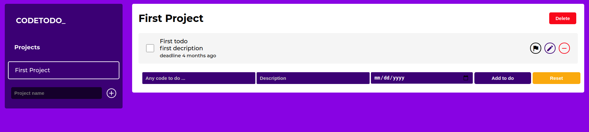

# Code to do

It is just a to do application for coders

## Screenshot



### :fire: [Demo](https://code-to-do.imhtapm.now.sh) 

## Contribution guide

1. Clone the project
```bash
  git clone https://github.com/Mesi21/Code-To-Do.git
  cd Code-To-Do
```

To start live-server

```bash
    npm start
```
To webpack watch

```bash
    npm run watch
``` 

2. Then :heavy_plus_sign: add your contribution
3. And Feel free to make a PR

## Tehnical tools:

- HTML & CSS
- JavaScript
- Webpack
- date-fnc

## Contributors

- Imhta [@imhta](https://github.com/imhta)
- Emese Molnar [@Mesi21](https://github.com/Mesi21)

## Contact info

Molnar Emese:
  - [Email:](mailto:mse212002@gmail.com) - mse212002@gmail.com
  - [Portfolio]()
  - [LinkedIn](https://www.linkedin.com/in/emesemesimolnar/)  
  - [Twitter](https://twitter.com/buksimesi21) 
  - [AngelList]()

### If you like this project don't forgot to support us by giving a :star: 

